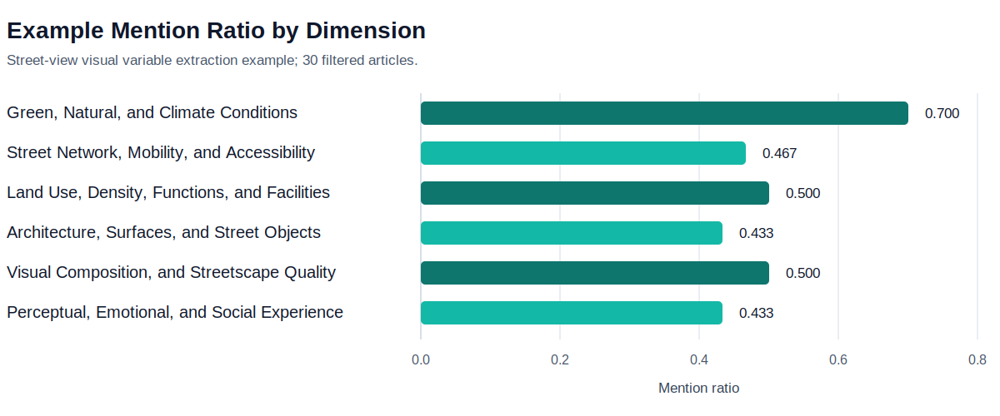

# Example Use Case: Street-View Visual Variables

This example shows one completed run for a street-view visual variable extraction task. The example is included to demonstrate the output structure; the workflow itself is topic-agnostic.

## Dimension Table

| Dimension | Subdimensions | Mention Ratio |
|---|---|---:|
| Green, Natural, and Climate Conditions | Vegetation and Green Visibility; Open Space, Terrain, and Landscape Elements; Shade, Thermal, Weather, and Sound Conditions | 0.700 |
| Street Network, Mobility, and Accessibility | Road Type and Street Configuration; Pedestrian, Cycling, and Transit Infrastructure; Accessibility, Route Efficiency, and Travel Activity | 0.467 |
| Land Use, Density, Functions, and Facilities | Density, Morphology, and Spatial Structure; Land Use, Commercial Activity, and Functional Mix; Amenities, Services, and Urban Facilities | 0.500 |
| Architecture, Surfaces, and Street Objects | Building Form and Facades; Street Objects, Barriers, and Edges; Surfaces, Hardscape, and Physical Disorder | 0.433 |
| Visual Composition, and Streetscape Quality | Openness, Enclosure, Sky, and Visibility; Color, Light, and Visual Texture; Streetscape Quality, Diversity, and Visual Attention | 0.500 |
| Perceptual, Emotional, and Social Experience | Safety, Comfort, and Fear-Related Perception; Aesthetic, Place, and Environmental Perception; Vitality, Liveliness, Wealth, and Social Sentiment; Negative Affect and Appraisal | 0.433 |

## Bar Chart

## Notes

- Mention ratio is calculated as articles mentioning the dimension divided by all filtered articles.
- The example table and chart are aggregate outputs. They do not include full abstracts or raw database exports.
